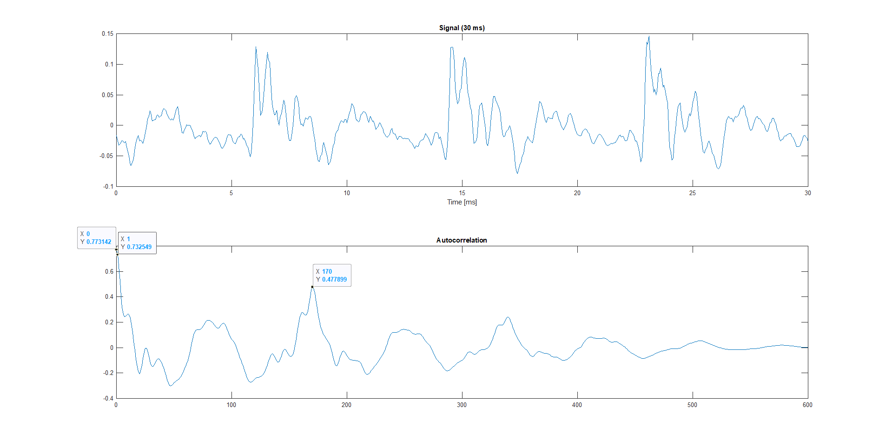
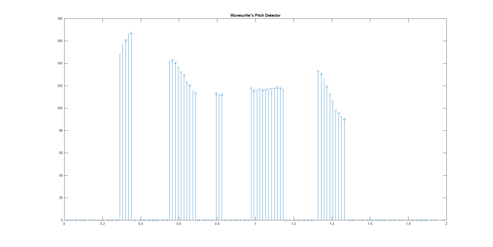
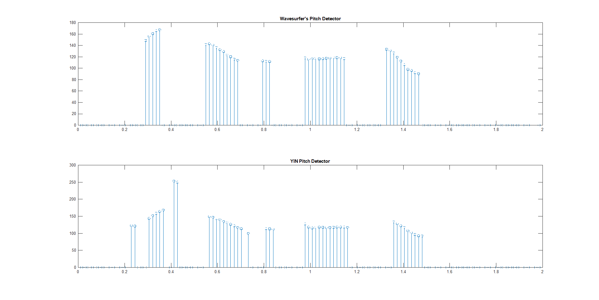
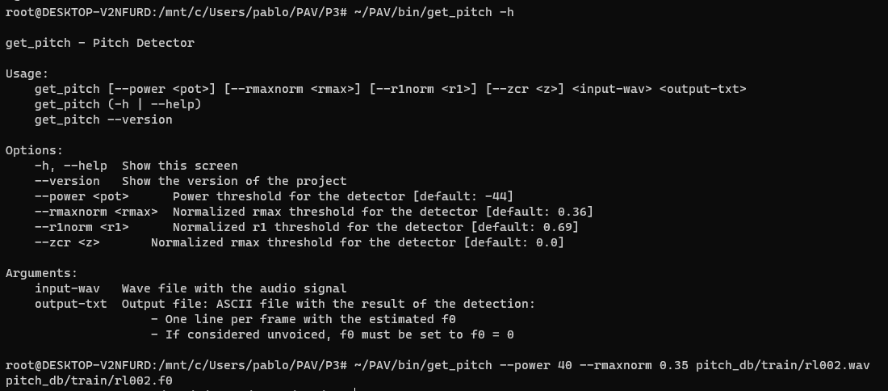

PAV - P3: detección de pitch
============================

Esta práctica se distribuye a través del repositorio GitHub [Práctica 3](https://github.com/albino-pav/P3). Siga las instrucciones de la [Práctica 2](https://github.com/albino-pav/P2) para realizar un `fork` de la misma y distribuir copias locales (*clones*) del mismo a los distintos integrantes del grupo de prácticas.

Recuerde realizar el *pull request* al repositorio original una vez completada la práctica.

Ejercicios básicos
------------------

- Complete el código de los ficheros necesarios para realizar la detección de pitch usando el programa `get_pitch`.

   * Complete el cálculo de la autocorrelación e inserte a continuación el código correspondiente.

      Código de la autocorrelación:

      ```cpp
      for (unsigned int l = 0; l < r.size(); ++l) {
        for (unsigned int n = 0; n < x.size() - l; ++n) {
          r[l] += x[n] * x[n + l];
        }
      }

      if (r[0] == 0.0F) //to avoid log() and divide zero
        r[0] = 1e-10;
      ```

   * Inserte una gŕafica donde, en un *subplot*, se vea con claridad la señal temporal de un segmento de unos 30 ms de un fonema sonoro y su periodo de pitch; y, en otro *subplot*, se vea con claridad la autocorrelación de la señal y la posición del primer máximo secundario.

	 NOTA: es más que probable que tenga que usar Python, Octave/MATLAB u otro programa semejante para hacerlo. Se valorará la utilización de la librería matplotlib de Python.

      Aquí està la imagen de la senyal (30 ms) con su correspondiente autocorrelación, vease que hemos marcado también los puntos clave para su uso posterior como són:
      + r[0] = 0.773142
      + r[1] = 0.732549
      + r[lag] = 0.477899

      

   * Determine el mejor candidato para el periodo de pitch localizando el primer máximo secundario de la autocorrelación. Inserte a continuación el código correspondiente.

      ```cpp
      unsigned int lag = iRMax - r.begin();
      unsigned int lag = 0;
      float Pmax = 0;

      for (unsigned int i = 0; iR != r.end(); ++iR) {
        if ((*iR > Pmax) && (i > npitch_min) && (i < npitch_max)){
          lag = i;
          Pmax = *iR;
        }
        ++i;
      }
      ```

   * Implemente la regla de decisión sonoro o sordo e inserte el código correspondiente.

      El código correspondiante al decisor que hemos usado es este. Habiendo probado por separado cada uno de los valores y analizado su capazidad detección en solitario, empezamos a probar combinaciones de estos basandonos en la teoria aprendida.
      Al final el que peroporcionó un mekor resultado fue el mostrado a continuación:

      ```cpp
      if ((r1norm > r1_th) && (rmaxnorm > rmax_th) && (pot > P_th))
        return false;
      else
        return true;
      ```
      Las variables con '_th' al final són los thresholds de cada uno de los parámetros.


- Una vez completados los puntos anteriores, dispondrá de una primera versión del detector de pitch. El resto del trabajo consiste, básicamente, en obtener las mejores prestaciones posibles con él.

  * Utilice el programa `wavesurfer` para analizar las condiciones apropiadas para determinar si un segmento es sonoro o sordo. 
	
	  - Inserte una gráfica con la detección de pitch incorporada a `wavesurfer` y, junto a ella, los principales candidatos para determinar la sonoridad de la voz: el nivel de potencia de la señal	(r[0]), la autocorrelación normalizada de uno (r1norm = r[1] / r[0]) y el valor de la	autocorrelación en su máximo secundario (rmaxnorm = r[lag] / r[0]).

		  Puede considerar, también, la conveniencia de usar la tasa de cruces por cero.

	    Recuerde configurar los paneles de datos para que el desplazamiento de ventana sea el adecuado, que	en esta práctica es de 15 ms.

        Los principales candidatos para determinar la autocorrelación los hemos calculado a partir de los valores marcados en la primera imagen usando el propio `MATLAB` y nos han dado el siguiente:

        r1norm = r[1] / r[0] = 0.9475
        rmaxnorm = r[lag] / r[0] = 0.4779

        En la siguiente imagen se puede observar el detector de pitch del `wavesurfer`, la grafica está echa con `MATLAB` a través de le fichero que el propio `wavesurfer` guarda al realizar sdu detector ESPS.

        

    - Use el detector de pitch implementado en el programa `wavesurfer` en una señal de prueba y compare su resultado con el obtenido por la mejor versión de su propio sistema.  Inserte una gráfica ilustrativa del resultado de ambos detectores.

        Aquí se muestra la comparación entre ambos detectores:

        
  
  * Optimice los parámetros de su sistema de detección de pitch e inserte una tabla con las tasas de error y el *score* TOTAL proporcionados por `pitch_evaluate` en la evaluación de la base de datos `pitch_db/train`..

      Summary
      Num. frames:    11191 = 7036 unvoiced + 4155 voiced
      Unvoiced frames as voiced:      214/7036 (3.04 %)
      Voiced frames as unvoiced:      467/4155 (11.24 %)
      Gross voiced errors (+20.00 %): 21/3688 (0.57 %)
      MSE of fine errors:     2.62 %

      ===>    TOTAL:  90.83 %

   * Inserte una gráfica en la que se vea con claridad el resultado de su detector de pitch junto al del detector de Wavesurfer. Aunque puede usarse Wavesurfer para obtener la representación, se valorará el uso de alternativas de mayor calidad (particularmente Python).
   
      Aquí se muestra la comparación entre ambos detectores:

      


Ejercicios de ampliación
------------------------

- Usando la librería `docopt_cpp`, modifique el fichero `get_pitch.cpp` para incorporar los parámetros del
  detector a los argumentos de la línea de comandos.
  
  Esta técnica le resultará especialmente útil para optimizar los parámetros del detector. Recuerde que
  una parte importante de la evaluación recaerá en el resultado obtenido en la detección de pitch en la
  base de datos.

  * Inserte un *pantallazo* en el que se vea el mensaje de ayuda del programa y un ejemplo de utilización
    con los argumentos añadidos.
    

- Implemente las técnicas que considere oportunas para optimizar las prestaciones del sistema de detección
  de pitch.

  Para nuestro sistema de detección de pitch nos hemos basado prácticamente por completo en un estimador conocido bajo el nombre de YIN. Su funcionamiento y características se pueden encontrar en el articulo:

    De Cheveigné, A., y Kawahara, H. (2002). YIN, a fundamental frequency estimator for speech and music. *The Journal of the Acoustical Society of America, 111.*

    Sobre este método, hemos tenido que realizar diferentes adaptaciones y/o mejoras, para que pudiera funcionar en nuestro programa. Aquí debajo teneis un resumen de estas así como las consclusiones que hemos ido sacando:

    * Hemos tenido que aplicar por ello varios cambios a la estructura de la práctica, como ampliar el tamaño del frame a 50ms para que quepan los 25ms de ventana de integración y los 25ms necesarios para la detección de un pitch de hasta 40Hz. Así como añadir los pasos 1-4 de dicho método. Con esto hemos logrado una primera base sobre la que trabajar.

    * Con dicha base, los resultados no eran muy prometedores, así que hemos tenido que realizar una serie de mejoras sobre esta. Lo primero que hemos hecho ha sido implementar el paso 5 del método de YIN, correspondiente a la interpolación parabólica. Este paso, si bien ha resultado relativamente sencillo de implementar y computacionalmente poco costoso, ha dado una mejora prácticamente negligible: en nuestras pruebas ha mejorado de manera constante el MSE en un 0.01%. Aun así hemos decidido dejarlo, por lo anteriormente descrito.

    * Lo siguiente era implementar el paso 6, pero computacionalmente era inviable para nuestros objetivos. Lo que hemos hecho en cambio ha sido implementar un filtro de mediana, que si bien no es lo mismo tenía sentido implementarlo, ya que el paso 6, como se describe en el artículo, se asemeja a un filtro de mediana, pero a corto plazo. Esto sí ha mejorado relativamente nuestro detector

    * Luego hemos añadido un preprocesado consistente en un filtro paso bajo rectangular de 1 ms con frecuencia de corte a 1kHz. Escondido entre el apartado de parámetros del paper se menciona que para obtener tales resultados se usaba exactamente el filtro que hemos descrito, así que hemos considerado razonable usarlo.

    * Hemos implementado una mejora respecto al método original: una aportación propia a este. En el paso 4, se realiza la búsqueda del mínimo de d'(t) que determina el pitch, pero para ello, ellos determinan primero un umbral absoluto, según el cual determinan el pitch como el menor valor de t que cumpla que d'(t) sea menor que tal umbral. Esto lo hacen para evitar detectar armónicos secundarios en vez del pitch, pero a mi parecer si esto puede implicar ciertos error fino. Este valor que se coje, puede no ser el valor mínimo del pico correspondiente al pitch, sino solo uno unas pocas muestras antes de éste que por cercanía está por debajo del umbral. Mi aportación en este caso es la de añadir un algoritmo que una vez encontrado el valor mínimo que cumpla el umbral, se busque el mínimo dentro de ese pico mismo (es decir, que siga buscando valores hasta que se deje de cumplir el umbral, y entre ellos escoja el mínimo). Esto ha significado una mejora del MSE de cerca del 0.15%. En este última modificación, si bien hemos probado tambien de realizar los mismo con la mediana, esta no nos ha funcionado tan bien como con la media.

    * Finalmente, hemos añadido tambien una mejora sobre programa que se beneficia del conocimiento que tenemos a priori sobre la forma de los datos a analizar. Concretamente nos aprovechamos de que sabemos que todos los ficheros de audio estan con una única voz por fichero, y que por lo tanto deberiamos obtener valores del pitch on una varianza relativamente baja. La mejora en sí, consiste en un algoritmo que calcula la media del pitch obtenido y marca como tramas sordas aquellas que presentan una desviación del pitch más grande de cierto valor respecto a la media. Esto implica 2 mejoras directamente: primero, que reduce el número de tramas detectadas como sonoras erróneamente, ya que muchas veces estas dan un pitch muy dispar. Luego (y esto es lo que nos hace cuestionar su moralidad), aquellas tramas cuyo pitch se ha detectado con un error muy grande, se dejan de tener en cuenta para calcular la puntuación de este, lo cual lo mejora significativamente.

A modo de conclusión, queríamos destacar algo que hemos aprendido durante la realizacón de la práctica y al contrastar resultados. El caso es que comparando nuestros resultados con los proporcionados en el articulo, hemos visto una gran disparidad, que no se puede justificar únicamente con las diferencias entre nuestra implementación y la descrita en el artícula. Estas diferencias se justifican con un descubrimiento que hemos hecho sobre el metodo de evaluación usado en tal publicación, que explican en gran parte sus buenos resultados. Concretamente se puede localizar la siguiente frase en la página 13 del articulo:

    `Ground-truth F0 estimates for the first four databases were extracted from the laryngograph signal using YIN.`
    
Es decir, que los datos con los que se evalúan todos los métodos, los han obtenido usando su propio método, con lo cual sería razonable afirmar que esté ligeramente sesgada para con su propio método. En uno de las tablas, se dan los valores obtenidos en las mismas bases de datos, pero usando los valores que habían proporcionado los autores de tales bases. En esta, el resultado obtenido en la DB2 (la usada en nuestra práctica) era un gross error del 2.2%, más en la linea de los resultados que estamos obteniendo nosotros en condiciones similares.  
   

Evaluación *ciega* del detector
-------------------------------

Antes de realizar el *pull request* debe asegurarse de que su repositorio contiene los ficheros necesarios
para compilar los programas correctamente ejecutando `make release`.

Con los ejecutables construidos de esta manera, los profesores de la asignatura procederán a evaluar el
detector con la parte de test de la base de datos (desconocida para los alumnos). Una parte importante de
la nota de la práctica recaerá en el resultado de esta evaluación.
